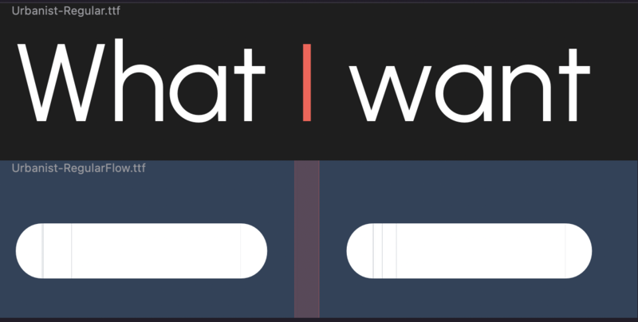
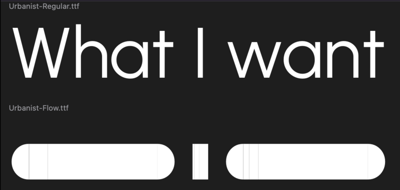

# Flowify: Turn a font into a flow font

A *flow font* is a unit-for-unit compatible version of a font used in UX/UI design mockups; in these situations, the actual text being displayed becomes a distraction from the design process, and so instead of having identifiable glyph shapes in each word, the font displays a rectangular or pill-shaped (["stadium"](https://mathworld.wolfram.com/Stadium.html)) slugs:


Flowify is a command line utility and a fontmake filter for turning fonts into flow fonts.

Example output from Flowify can be found in the [`output/`](output/) directory.

Flowify builds on the existing layout rules of the font, and should therefore create unit-for-unit compatible flow fonts even taking into account kerning and complex shaping rules. **Note that flowify cannot be used to create variable fonts.**

## How do I use it?

The easiest and quickest way to generate flow fonts is to use flowify as a fontmake filter. First install this module:

```
% pip install flowify
```

Then add `--filter "flowify::FlowifyFilter(pre=True)"` to your fontmake command line. e.g.:

```
% fontmake -o ttf -i -g Urbanist.glyphs --filter "flowify::FlowifyFilter(pre=True)"
```

Note that the filenames produced by this command will still be the original names (e.g. `Urbanist-BlackItalic.ttf`) but the names in the `name` table will have the word "Flow" added (`Urbanist Black Italic Flow`).

Alternatively, flowify can be used to filter UFO files and write flow versions:

```
% flowify master_ufo/Urbanist-Italic.ufo master_ufo/Urbanist-ItalicFlow.ufo
```

## How it works

Flowify works by adding a series of slug glyphs of different widths to your font, as well as glyphs for the starting and ending semicircles of the slug.

It also adds a number of OpenType lookups at the end of your font's OpenType code. First, it adds `_start` and `_end` marker glyphs around each word, so `t h e space b i g` becomes `_start t h e _end space _start b i g _end`

Next, each glyph is substituted by slug glyphs which encode its width. A simplified version of this substitution looks like this: an `a` glyph with width 324 would be replaced by `w300 w020 w004`. After this, glyphs between each `_start` and `_end` marker are *summed*, using an adding routine similar to that of an electronic adder circuit. (Many thanks to David Corbett for pointing out this approach and providing me with an example implementation.)

Finally, there is a lookup which makes a decision based on the total width of each slug: if the slug's width is larger than the width of the start and end semicircular caps, then the caps are added and the width of the caps is subtracted from the slug's width; if not (i.e. the word is too narrow for semicircular caps to fit), then the slugs are replaced by blank spaces:



If you want to have a rectangular slug with no semicircular end caps in this situation, you can customize the output using the options below.

## Options

### Changing the slug shape

flowify creates pill-shaped slugs by default, as this is thought to better represent the shape of a word. However, for some scripts, rectangular slugs may be a better choice. You can control the slug shape by passing the `--shape=rectangle` option to the command line script or adding `,shape='rectangle'` to the fontmake filter line (e.g. `flowify::FlowifyFilter(pre=True,shape='rectangle'`).

### Altering the slug height

By default, the slug runs vertically from the baseline to the font's x-height. In most cases, this is the desired behaviour; however, for certain fonts (for example, fancy handwriting fonts with a very low x-height) you may wish to change the slug height. You can do this by passing the `--slug-height` option to the command line or `slug_height` parameter to the fontmake filter. Valid values are `x` for x-height slugs (the default), `cap` for the font's cap height, or an integer value in font units.

Here is an example of a Devanagari font (Vaibhav Singh and Rosetta Type's Eczar) with `slug_height='cap',shape='rectangle'`:


### Changing the blanking behaviour

As mentioned above, if the total width of a pill-shaped slug is not wide enough to fit the semicircular caps, the entire pill is blanked out. This avoids mixing rectangular and pill shaped slugs, but it may leave unsightly gaps in the middle of the text. If a mix of rectangles and pills is acceptable, then you can set `--no-blank` (fontmake: `no_blank=True`) to disable this behaviour.



### Changing the cap sidebearings

The start and end semicircles have a default sidebearing of 20 units. This can be customized with the `--margin` option.

### Debugging the algorithm

The summation algorithm uses base 4 arithmetic, which is difficult to understand. If you want to follow how the algorithm works in a tool like [Crowbar](http://corvelsoftware.co.uk/crowbar/), adding the `--debugging` option will switch to base 10 arithmetic, allowing you to more easily understand the place-value system of width encoding. This flag also adds 50 glyphs to the Private Use Area (0xE000-0xE032) with advance widths 0-49, allowing you to experiment with adding arbitrary numbers together.

### Changing the OpenType feature

By default, the flowification code is added to the OpenType `rlig` feature of the output font. This will force the flowification to be unconditionally applied for most scripts. But you may wish to do something different!

For example, you might create a font that also contains a flowified version as a stylistic set - you can do this by adding `--feature=ss01` (fontmake: `feature='ss01'`) to the options.

